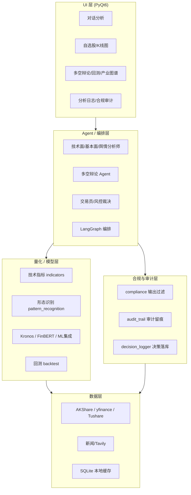

# 架构说明（ARCHITECTURE）

疏影·知微是一个本地优先、数据不出本机的桌面金融数据分析工具。整体分为四层：
**数据层 → 量化/模型层 → 合规层 → UI 层**。所有 AI 分析结果都经过合规过滤与审计留痕。

## 分层结构

## 各模块职责

| 层 | 模块 | 职责 |
|---|---|---|
| 数据层 | `core/data/*` | 多源行情/新闻获取、SQLite 缓存、行业图谱 |
| 量化层 | `core/quant/*` | 技术指标、回测、多因子、市场状态、ML 信号 |
| 模型层 | `core/ml/*` | Kronos K线预测、FinBERT 情感 |
| Agent 层 | `core/agents/*` | 多智能体编排（LangGraph）与 Pydantic 输出契约 |
| 合规层 | `core/compliance.py` | 敏感词过滤；`core/audit_trail.py` 审计留痕 |
| 记录层 | `decision_logger.py` | AI 分析日志（JSON/CSV 导出） |
| 研究层 | `core/research_journal.py` | 研究笔记与复盘报告 |
| 报告层 | `core/report_generator.py` | Markdown/HTML 报告导出 |
| UI 层 | `app/ui/*` | 各功能标签页与三栏联动 |

## 关键设计原则
- **point-in-time**：历史数据只增不改，回测无未来函数（信号 `shift(1)` 后生效）。
- **本地优先**：除用户自己配置的云端 LLM API Key 外，不向开发者上传任何数据。
- **合规兜底**：任何 AI 输出都过 `sanitize_ai_output`，并写入 `audit_trail`。
- **永不崩主流程**：日志、审计、报告等横切模块全部 try-except 静默兜底。
