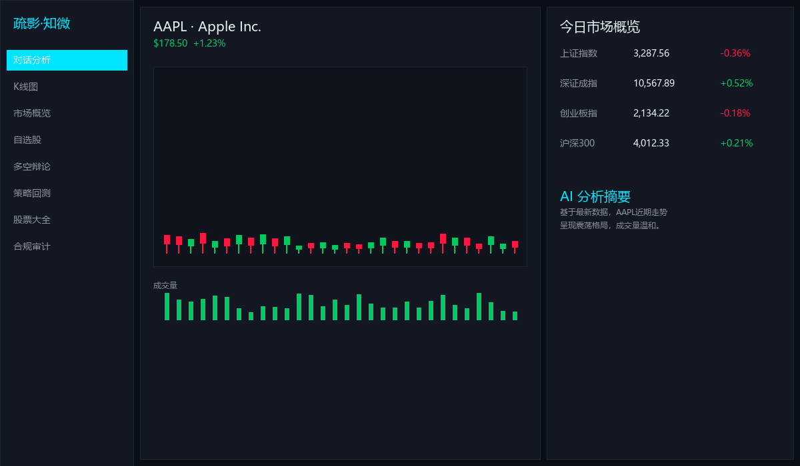
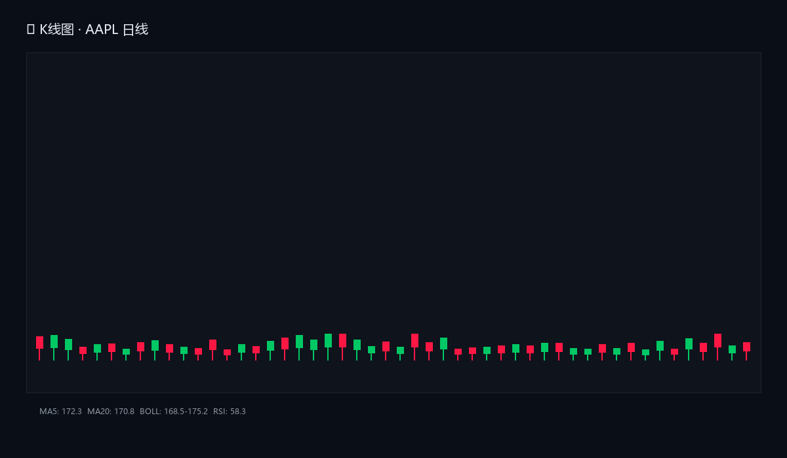
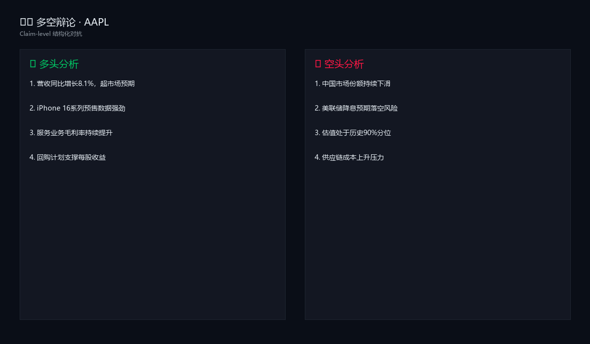

# 疏影·知微 · Shuying Insight
### 本地优先的开源 AI 金融数据分析终端

> "疏影横斜水清浅，暗香浮动月黄昏。"
> 在算力洪流与商业喧嚣中，保持独立、清醒与纯粹。

[](https://opensource.org/licenses/MIT)
[](https://www.python.org/)
[](https://github.com/ShuYing07)
[](https://github.com/ShuYing07/Penumbra/releases/latest)

---

## 🖥️ 界面预览


*暗色三栏布局：自选股 | K线图 | 信息面板*


*蜡烛图 + MA均线 + 布林带 + 成交量副图*


*Claim-level 结构化多空对抗*

---

## ⚡ 一键下载（Windows）

**不想装Python？直接下载解压即用：**

👉 **[疏影知微_v0.7.0.zip](https://github.com/ShuYing07/Penumbra/releases/latest)** （约360MB）

解压后双击 `疏影知微.exe` 即可运行，无需安装Python、无需配置环境。

---

## 🧭 这是什么？

**疏影·知微（Shuying Insight）** 是一个完全开源、本地运行、数据不出本地的 AI 金融数据分析终端。它不是荐股软件，不预测股价，不提供买卖建议。它只做一件事：

**把复杂的金融数据，变成你可以理解、审查、推演的结构化信息。**

在这里，AI 不是替你决策的"股神"，而是帮你从多角度审视问题的"研究助手"。

> 让模型辩论，让人决策。

---

## ⚖️ 为什么选我们？

| 特性 | 疏影·知微 | 同花顺 | 东方财富 | OpenBB |
|------|----------|--------|----------|--------|
| 本地运行 | ✅ | ❌ | ❌ | ✅ |
| 无广告 | ✅ | ❌ | ❌ | ✅ |
| 开源可审计 | ✅ | ❌ | ❌ | ✅ |
| 多空辩论 | ✅ | ❌ | ❌ | ❌ |
| 多模型AI路由 | ✅ | 仅自研 | 仅自研 | ❌ |
| 数据不出本地 | ✅ | ❌ | ❌ | ✅ |
| 免费 | ✅ | 部分 | 部分 | ✅ |

> **如果你在意数据隐私、讨厌广告、想用AI辅助研究但不信任云端——疏影知微就是为你做的。**

---

## 🚀 5分钟快速上手

1. **下载解压** → 双击 `疏影知微.exe`
2. **首次启动** → 自动加载示例（贵州茅台 600519）
3. **查看K线** → 左侧点击"K线图"，看技术指标
4. **运行分析** → 对话分析页输入代码，点击搜索
5. **多空辩论** → 左侧点击"多空辩论"，查看结构化对抗

---

## ⚠️ 合规声明

本工具为开源金融数据分析软件，**仅供研究学习使用**。
本工具**不提供任何证券投资分析、预测或建议，不构成任何投资建议，不是荐股软件**；开发者**不具备中国证监会证券投资咨询业务资格**。
证券投资存在高风险，历史回测不代表未来表现。

详见 [DISCLAIMER.md](DISCLAIMER.md)。

---

## 🛠️ 核心功能

### ⚔️ 多智能体辩论
看多/看空两个对立Agent基于同一组数据给出相反逻辑推演，你对照阅读，避免被单一视角误导。

### 📊 K线图与技术指标
蜡烛图 + MA5/10/20/60 + MACD + RSI + 布林带 + KDJ + 成交量副图。支持滚轮缩放、拖拽平移、十字光标。

### 🔬 策略回测
严格T+1次日开盘成交（无前视），输出年化收益、最大回撤、夏普比率、胜率、盈亏比。

### 📰 新闻与公告
接入AKShare财经新闻、个股新闻、公司公告、券商研报，自动情感标注。

### 🧠 多模型路由
支持DeepSeek、通义千问、智谱GLM、Groq、Ollama本地模型，自动降级。

### 📝 决策日志
每次AI分析自动落库（本地SQLite），支持复盘与导出。

---

## 🏗️ 技术栈

Python 3.11+ · PyQt6 · PyQtGraph · LangGraph · Pandas · AKShare · Tushare · yfinance · SQLite · DeepSeek API · Ollama

---

## 📁 从源码运行

```bash
git clone https://github.com/ShuYing07/Penumbra.git
cd Penumbra
python -m venv venv
venv\Scripts\activate
pip install -r requirements.txt
copy .env.example .env   # 填入DEEPSEEK_API_KEY
python main.py
```

---

## 🤝 贡献

欢迎Issue与PR。请阅读 [CONTRIBUTING.md](CONTRIBUTING.md)。

---

## ❤️ 支持开发者

独立开发者课余时间维护。你的支持将用于AI API费用与GPU测试。

- **爱发电**：https://afdian.com/shuying07
- **GitHub Sponsors**：https://github.com/sponsors/ShuYing07

---

## 📄 许可证

[MIT License](LICENSE) © 2026 ShuYing07。本软件仅供研究学习使用。
