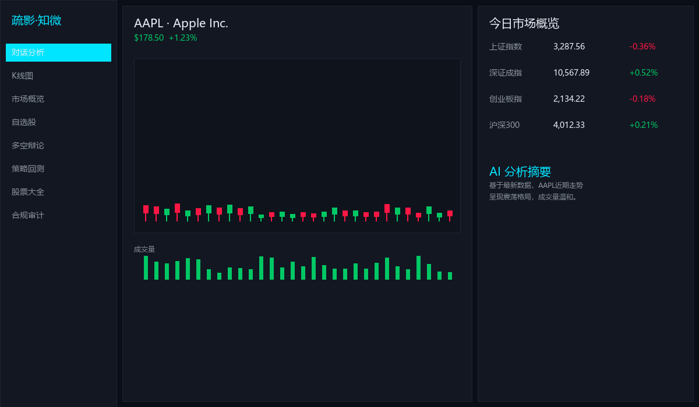
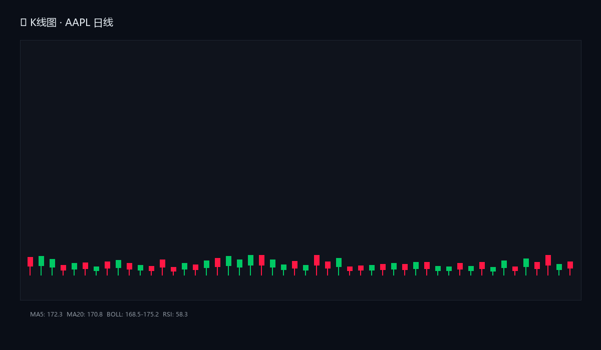
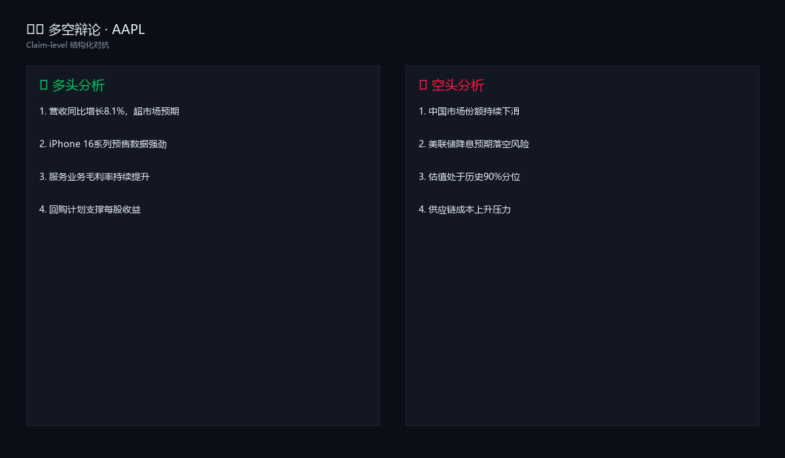

# 疏影·知微 · Shuying Insight
### 本地优先的开源 AI 金融数据分析终端

> "疏影横斜水清浅，暗香浮动月黄昏。"
> 在算力洪流与商业喧嚣中，保持独立、清醒与纯粹。

[](https://opensource.org/licenses/MIT)
[](https://www.python.org/)
[](https://github.com/ShuYing07)
[](https://github.com/ShuYing07/Penumbra/releases/latest)

---

## 🖥️ 界面预览


*任务导向分组导航（发现/研究/验证/积累）+ 可停靠 Widget 工作区*


*蜡烛图 + MA均线 + 布林带 + 成交量副图 + 悬停图例 + 区间按钮*


*Claim-level 结构化多空对抗*


*宽基指数 + 板块热力图（Treemap）*

---

## 🎨 UI 设计系统（0.7.x 起）

**疏影·知微** 的界面参考了 OpenBB Workspace / FreqUI / Stonks / OpenTerminal 等开源项目的设计，采用 **任务导向分组导航 + 玻璃拟态暗色主题 + 键盘驱动交互**：

- **信息架构**：左侧导航按任务阶段分组 —— `发现`（找标的）→ `研究`（深理解）→ `验证`（验判断）→ `积累`（沉淀知识）；右侧信息面板为 **QDockWidget 可停靠工作区**，可浮动/关闭，布局自动保存、下次启动恢复（`视图` 菜单可恢复默认布局）。
- **视觉风格**：暗色玻璃态（主背景 `#0A0E17`，卡片半透明 + 1px 青色细边 + 大圆角）；顶部状态栏一键切换 **暗色/浅色** 主题（快捷键 `Ctrl+M`）。
- **键盘驱动**：`Ctrl+K` 全局命令面板（搜功能/股票/历史，支持拼音缩写如 `gzmt`→贵州茅台）；`Ctrl+1~9` 快速切换导航；`Ctrl+Shift+A` 唤起 AI 对话、`Ctrl+Shift+B` 多空辩论、`Ctrl+Shift+R` 运行回测。
- **对话式首页**：打开程序即对话输入框 + 三个快捷入口（分析个股/多空辩论/今日复盘）；AI 执行过程以**时间线**逐步打勾（识别市场→采集行情→计算指标→生成报告），不再干等。
- **图表升级**：K线图悬停显示 OHLC+均线+成交量图例，支持 1M/3M/6M/1Y/MAX 区间切换；市场概览内置**板块热力图**（面积≈成交额，颜色=涨跌幅）。
- **首次启动**：3 页欢迎引导（可跳过）+ 默认自选股（茅台/苹果/沪深300/宁德/腾讯）+ 空状态友好提示。

> 完整设计规范与配色 Token 见 [`docs/UI_GUIDE.md`](docs/UI_GUIDE.md)。

---

## ⚡ 一键下载（Windows）

**不想装Python？直接下载解压即用：**

👉 **[疏影知微_v0.7.0.zip](https://github.com/ShuYing07/Penumbra/releases/latest)** （约360MB）

解压后双击 `疏影知微.exe` 即可运行，无需安装Python、无需配置环境。

---

## 🧭 这是什么？

**疏影·知微（Shuying Insight）** 是一个完全开源、本地运行、数据不出本地的 AI 金融数据分析终端。它不是荐股软件，不预测股价，不提供买卖建议。它只做一件事：

**把复杂的金融数据，变成你可以理解、审查、推演的结构化信息。**

在这里，AI 不是替你决策的"股神"，而是帮你从多角度审视问题的"研究助手"。

> 让模型辩论，让人决策。

---

## ⚖️ 为什么选我们？

| 特性 | 疏影·知微 | 同花顺 | 东方财富 | OpenBB |
|------|----------|--------|----------|--------|
| 本地运行 | ✅ | ❌ | ❌ | ✅ |
| 无广告 | ✅ | ❌ | ❌ | ✅ |
| 开源可审计 | ✅ | ❌ | ❌ | ✅ |
| 多空辩论 | ✅ | ❌ | ❌ | ❌ |
| 多模型AI路由 | ✅ | 仅自研 | 仅自研 | ❌ |
| 数据不出本地 | ✅ | ❌ | ❌ | ✅ |
| 免费 | ✅ | 部分 | 部分 | ✅ |

> **如果你在意数据隐私、讨厌广告、想用AI辅助研究但不信任云端——疏影知微就是为你做的。**

---

## 🚀 5分钟快速上手

1. **下载解压** → 双击 `疏影知微.exe`
2. **首次启动** → 3 页欢迎引导（可跳过）+ 自动加载示例（贵州茅台 600519）
3. **看行情** → 左侧 `研究 → K线图`，或直接按 `Ctrl+K` 输入 `600519` / `gzmt` 跳转
4. **运行分析** → 对话分析页输入代码回车，看 AI 执行时间线逐步打勾
5. **多空辩论** → 左侧点击"多空辩论"，或按 `Ctrl+Shift+B`，查看结构化对抗

> 💡 常用快捷键：`Ctrl+K` 全局命令面板 · `Ctrl+M` 切换明暗主题 · `Ctrl+1~9` 快速切导航

---

## ⚠️ 合规声明

本工具为开源金融数据分析软件，**仅供研究学习使用**。
本工具**不提供任何证券投资分析、预测或建议，不构成任何投资建议，不是荐股软件**；开发者**不具备中国证监会证券投资咨询业务资格**。
证券投资存在高风险，历史回测不代表未来表现。

详见 [DISCLAIMER.md](DISCLAIMER.md)。

---

## 🛠️ 核心功能

### ⚔️ 多智能体辩论
看多/看空两个对立Agent基于同一组数据给出相反逻辑推演，你对照阅读，避免被单一视角误导。

### 📊 K线图与技术指标
蜡烛图 + MA5/10/20/60 + MACD + RSI + 布林带 + KDJ + 成交量副图。支持滚轮缩放、拖拽平移、十字光标。

### 🔬 策略回测
严格T+1次日开盘成交（无前视），输出年化收益、最大回撤、夏普比率、胜率、盈亏比。

### 📰 新闻与公告
接入AKShare财经新闻、个股新闻、公司公告、券商研报，自动情感标注。

### 🧠 多模型路由
支持DeepSeek、通义千问、智谱GLM、Groq、Ollama本地模型，自动降级。

### 📝 决策日志
每次AI分析自动落库（本地SQLite），支持复盘与导出。

---

## 🧠 本地模型（可选，完全离线）

程序默认走云端 API（需自行配置 Key）。想**完全离线**运行，可选装本地模型：

1. 安装 [Ollama](https://ollama.com) 并拉取模型：
   ```bash
   ollama pull qwen3:7b
   ```
2. 程序启动时自动检测本地模型并降级使用，无需额外配置。

> `models/` 目录用于存放可选大模型（如 Qwen2.5-3B-Instruct、Kronos），需手动下载放置，详见 [models/README.md](models/README.md)。**不下载也不影响使用**——自动降级到云端 API。

---

## 🏢 企业版（Enterprise）

面向团队与机构：多租户隔离、RBAC 权限、操作审计、协作空间、组合风控、合规规则引擎、REST API、私有化部署（Docker/K8s）。

- 文档：[docs/ENTERPRISE.md](docs/ENTERPRISE.md) · [docs/COMPLIANCE.md](docs/COMPLIANCE.md)
- API：安装 `pip install fastapi uvicorn[standard]` 后运行 `python -m api.main`，接口见 [docs/API.md](docs/API.md)

| 能力 | 社区版 | 企业版 |
|------|-------|--------|
| 多租户隔离 / RBAC / 审计日志 | ❌ | ✅ |
| 协作空间 / 版本控制 | ❌ | ✅ |
| 组合风控（VaR/压力测试） | ❌ | ✅ |
| 合规规则引擎（禁投/仓位上限） | ❌ | ✅ |
| REST API + 私有化部署 | ❌ | ✅ |

**本版新增的企业级/国际化深化模块（0.7.x 前瞻）**：

| 模块 | 目录 | 说明 |
|---|---|---|
| Agent Mesh 智能体网格 | `agent_mesh/` | Agent 注册/身份/策略执行/可观测账本 |
| 零信任安全 | `security/` | 持续认证、上下文授权、哈希链审计 |
| 双层级记忆 | `memory/` | 向量记忆（ChromaDB）+ 图记忆（Neo4j/内存图）+ 混合检索 |
| 混合推理 | `reasoning/` | auto/structured/retrieval 动态策略 + 置信度门控 |
| 数据网格 | `data_mesh/` | 数据域、数据目录、数据契约 |
| 实时流处理 | `streaming/` | 事件总线、流式摄取、背压与窗口计算 |
| HERMES 分层 Agent | `hermes/` | 五层检索-验证-合成-共识-报告，自适应共识 |
| Swarm 估值 | `valuation_swarm/` | 3任务×3Agent 估值 + 辩论对齐比例投票 |
| 湖仓与流管道 | `data_pipeline/` | 版本快照湖仓（时间旅行）、Sidecar 行情网关 |
| 微前端 | `micro_frontend/` | Shell + 独立功能模块 + 统一安全层 |
| 主权 Agent（SAFE） | `sovereign_agent/` | 私有化部署、BYOM 模型注册、成本追踪 |
| 持续合规监控 | `compliance/` | 实时监测 + 人工审核队列 + 可配置规则引擎 |
| 国际化数据适配器 | `data_adapters/` | Bloomberg/LSEG/Wind/AKShare/yfinance 统一接口 |

文档：[docs/ENTERPRISE_DEPLOYMENT.md](docs/ENTERPRISE_DEPLOYMENT.md) ·
[docs/FINOS_INTEGRATION.md](docs/FINOS_INTEGRATION.md) ·
[docs/PRODUCT_FOCUS.md](docs/PRODUCT_FOCUS.md)

---

## 🏗️ 技术栈

Python 3.11+ · PyQt6 · PyQtGraph · LangGraph · Pandas · AKShare · Tushare · yfinance · SQLite · DeepSeek API · Ollama

---

## 📁 从源码运行

```bash
git clone https://github.com/ShuYing07/Penumbra.git
cd Penumbra
python -m venv venv
venv\Scripts\activate
pip install -r requirements.txt
copy .env.example .env   # 填入DEEPSEEK_API_KEY
python main.py
```

---

## 🤝 贡献

欢迎Issue与PR。请阅读 [CONTRIBUTING.md](CONTRIBUTING.md)。

---

## ❤️ 支持开发者

独立开发者课余时间维护。你的支持将用于AI API费用与GPU测试。

- **爱发电**：https://afdian.com/shuying07
- **GitHub Sponsors**：https://github.com/sponsors/ShuYing07

---

## 📄 许可证

[MIT License](LICENSE) © 2026 ShuYing07。本软件仅供研究学习使用。
